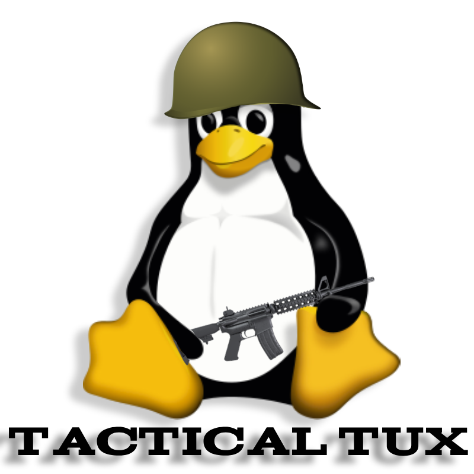

<p align="center">
  
</p>

# 🐧 Tactical Tux


**Tactical Tux** is an open-source 3D FPS game engine built from scratch using OpenGL and C++. No external game engines - just raw code and determination! 🚀

> ⚠️ **Early Alpha Status**: This project is in very early development. Expect bugs, missing features, and breaking changes.

## 🎮 Features (Current)

- ✅ First-person camera system with mouse look
- ✅ WASD movement controls
- ✅ Physics system with collision detection
- ✅ Crosshair overlay
- ✅ In-game map editor
- ✅ Basic 3D rendering with colored meshes
- ✅ Custom shader system
- ✅ Gravity and ground detection

## 🎯 Roadmap

- [ ] Weapon system and shooting mechanics
- [ ] Texture support
- [ ] Lighting and shadows
- [ ] 3D model loading (Assimp)
- [ ] Sound effects and music (OpenAL)
- [ ] AI enemies
- [ ] Particle effects
- [ ] Menu system
- [ ] Multiplayer support (distant future)

## 📸 Screenshots/GIF's


*Early alpha gameplay - showing basic level geometry and crosshair*

## 🛠️ Building from Source

### Cross-Platform Support

Tactical Tux now builds on **Linux** and **macOS**! All dependencies are automatically downloaded via CMake FetchContent.

### Requirements

**Linux:**
- GCC/G++ compiler
- CMake 3.14+
- X11 development libraries

**macOS:**
- Xcode Command Line Tools
- CMake 3.14+

### Quick Start

**Linux:**
```bash
# Install dependencies
sudo apt update
sudo apt install build-essential cmake git xorg-dev libgl1-mesa-dev

# Clone and build
git clone https://github.com/kj-devvixon/tactical-tux.git
cd tactical-tux
chmod +x build.sh
./build.sh

# Run
./build/TacticalTux
```

**macOS:**
```bash
# Install dependencies
brew install cmake

# Clone and build
git clone https://github.com/kj-devvixon/tactical-tux.git
cd tactical-tux
chmod +x build.sh
./build.sh

# Run
./build/TacticalTux
```

> 📝 **Note:** First build will take 2-5 minutes as CMake downloads GLFW, GLEW, and GLM automatically. Subsequent builds are much faster!

### Manual Build

If you prefer manual building, see [BUILD.md](BUILD.md) for detailed instructions.

## 🎮 Controls

| Key | Action |
|-----|--------|
| `W` `A` `S` `D` | Move around |
| `Mouse` | Look around |
| `Space` | Jump / Move up |
| `Left Shift` | Crouch / Move down |
| `ESC` | Exit game |

### Map Editor Controls (if enabled)
| Key | Action |
|-----|--------|
| `E` | Add object at crosshair |
| `R` | Remove object |
| `F5` | Save map |
| `F9` | Load map |

## 📁 Project Structure

```
tactical-tux/
├── CMakeLists.txt          # Build configuration
├── build.sh                # Build script
├── src/
│   ├── main.cpp           # Main game loop
│   ├── Camera.cpp         # Camera system
│   ├── Shader.cpp         # Shader management
│   ├── Mesh.cpp           # 3D mesh rendering
│   ├── Player.cpp         # Player controller
│   ├── Physics.cpp        # Physics & collision
│   ├── Crosshair.cpp      # HUD crosshair
│   └── MapEditor.cpp      # Level editor
├── include/               # Header files
├── shaders/
│   ├── vertex.glsl        # Vertex shader
│   └── fragment.glsl      # Fragment shader
└── assets/                # Game assets (future)
```

## 🤝 Contributing

Contributions are welcome! This is a learning project, so don't be afraid to suggest improvements or add features.

1. Fork the repository
2. Create your feature branch (`git checkout -b feature/AmazingFeature`)
3. Commit your changes (`git commit -m 'Add some AmazingFeature'`)
4. Push to the branch (`git push origin feature/AmazingFeature`)
5. Open a Pull Request

### Development Guidelines

- Keep code readable and well-commented
- Follow existing code style
- Test your changes before submitting
- Update README if you add new features or controls

## 📝 License

This project is licensed under the MIT License - see the [LICENSE](LICENSE) file for details.

## 🙏 Acknowledgments

- Inspired by classic FPS games and the desire to learn OpenGL
- Thanks to the open-source community for tools and libraries
- Special thanks to [LearnOpenGL](https://learnopengl.com) for amazing tutorials

## 💬 Contact

Have questions or suggestions? Open an issue on GitHub!

---

**Made with ❤️ and C++ - Cross-Platform Gaming!** 🐧 🍎
